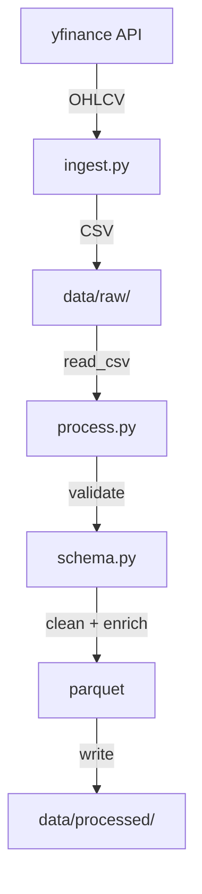

# Pipeline de Dados Diário - Documentação

## 📋 Visão Geral

O sistema de coleta de cotações diárias automatiza o processo de:
1. **Ingestão**: Busca dados OHLCV (Open, High, Low, Close, Volume) via yfinance
2. **Processamento**: Valida, limpa e enriquece os dados com features
3. **Persistência**: Armazena em raw (CSV) e processed (Parquet)

Suporta dois modos de execução:
- **Local**: Scheduler APScheduler contínuo ou sob demanda
- **AWS EventBridge/Lambda**: Disparado por eventos agendados na nuvem

## 🎯 Arquitetura

```
yfinance → [ingest.py] → data/raw/ohlcv_raw.csv
                              ↓
                         [process.py]
                              ↓
                    data/processed/ohlcv_processed.parquet
```

### Componentes

| Arquivo | Função |
|---------|--------|
| `src/data/ingest.py` | Busca dados do yfinance (histórico ou incremental) |
| `src/data/scheduler.py` | Agenda execuções + handlers EventBridge/Lambda |
| `src/data/lambda_function.py` | Entry point para AWS Lambda |
| `src/features/process.py` | Processamento, validação e enriquecimento |
| `src/features/schema.py` | Definições de schema com Pandera |
| `configs/model_config.yaml` | Parâmetros (tickers, datas, ranges) |

## ✅ Uso

### 1️⃣ Instalação

```bash
# Instalar dependências
make install
# ou
pip install -e .
```

### 2️⃣ Busca Histórica (Inicial)

Busca dados de um período específico definido em `model_config.yaml`:

```bash
make fetch
# ou
python -m src.data.ingest historical
```

**Saída**: `data/raw/ohlcv_raw.csv` (dados históricos completos)

### 3️⃣ Processamento

Limpa, valida e enriquece os dados:

```bash
make process
# ou
python -m src.features.process
```

**Saída**: `data/processed/ohlcv_processed.parquet`

### 4️⃣ Busca Diária Incremental

Busca apenas os últimos N dias (padrão: 7) e faz merge com dados existentes:

```bash
make fetch-daily
# ou
python -m src.data.ingest incremental 7
```

**Argumentos**:
- `incremental`: modo incremental
- `7`: busca últimos 7 dias (configurável)

### 5️⃣ Pipeline Completo (Uma Única Execução)

Executa ingestão + processamento em sequência:

```bash
make pipeline
# ou
python -m src.data.ingest incremental 7 && python -m src.features.process
```

## 🔄 Agendamento Automático

### Opção A: Scheduler Contínuo (Recomendado)

Executa o pipeline todos os dias às 18:00 UTC:

```bash
make scheduler
# ou
python -m src.data.scheduler
```

**Características**:
- Roda em background enquanto estiver rodando o terminal
- Logs em tempo real
- Para com `Ctrl+C`

### Opção B: Teste Único

Executa o pipeline uma vez (para testes):

```bash
make scheduler-once
# ou
python -m src.data.scheduler once
```

### Opção C: Docker (Produção)

Roda o scheduler como container Docker em background permanente:

```bash
# Construir imagem
docker-compose build

# Iniciar scheduler em background
docker-compose up -d

# Ver logs
docker-compose logs -f data-scheduler

# Parar
docker-compose down
```

### Opção D: Background (Linux/Mac)

```bash
make scheduler-daemon
```

Inicia scheduler em background permanente com logs em `logs/scheduler.log`.

### Opção E: AWS EventBridge (Recomendado para Produção)

Dispara o pipeline através do AWS EventBridge em horários agendados:

```bash
# Testar com evento EventBridge simulado
make test-event

# Build e deploy da função Lambda
make lambda-build
make lambda-deploy

# Invocar Lambda
make lambda-invoke

# Ver logs do Lambda
make lambda-logs
```

**Vantagens**:
- Escala automática (serverless)
- Sem custos quando não executando
- Integração nativa com AWS
- Alertas e monitoramento CloudWatch
- ~$20/mês em custos

Ver [AWS_EVENTBRIDGE_SETUP.md](AWS_EVENTBRIDGE_SETUP.md) para configuração completa.

## 📊 Configuração

Edit `configs/model_config.yaml`:

```yaml
fetch:
  tickers:
    - AAPL
    - MSFT
    - GOOGL
    - AMZN
    - META
  start_date: "2023-01-01"
  end_date: "2024-12-31"
  interval: "1d"

process:
  min_price: 0.01
  max_price: 1000000.0
  min_volume: 0
  max_volume: 100000000000
  output_format: "parquet"
```

### Alterando Hora de Execução

Para rodar em horário diferente (ex: 15:00):

```bash
python -m src.data.scheduler 15 0
# Argumentos: hora (0-23) minuto (0-59)
```

## 🌥️ EventBridge Events

### Formato do Evento

O EventBridge envia eventos em formato JSON que são processados pela função Lambda:

```json
{
    "source": "aws.events",
    "detail-type": "Scheduled Event",
    "detail": {
        "days_back": 7,
        "request_id": "optional-custom-id"
    },
    "time": "2026-04-19T18:00:00Z",
    "region": "us-east-1",
    "account": "123456789012"
}
```

### Customizar Evento

Você pode customizar o comportamento através do `detail`:

```json
{
    "detail": {
        "days_back": 14,           // Buscar últimos 14 dias (padrão: 7)
        "source_system": "eventbridge"  // Identificação da origem
    }
}
```

### Testar Evento Localmente

```bash
make test-event
# ou
python -m src.data.scheduler test-event
```

### Estrutura da Resposta Lambda

**Sucesso (200)**:
```json
{
    "statusCode": 200,
    "body": {
        "status": "success",
        "event_source": "eventbridge",
        "timestamp": "2026-04-19T18:00:05.123456",
        "steps": {
            "fetch": {
                "status": "success",
                "days_back": 7
            },
            "process": {
                "status": "success"
            }
        },
        "message": "Pipeline executado com sucesso"
    }
}
```

**Erro (400/500)**:
```json
{
    "statusCode": 500,
    "body": {
        "status": "error",
        "message": "Descrição do erro",
        "error_type": "RuntimeError"
    }
}
```

## 📈 Fluxo de Dados



## 🛡️ Validação

Dois níveis de schema validation com Pandera:

1. **Raw Schema**: Valida dados recebidos do yfinance
   - Tipos: Open, High, Low, Close (float), Volume (float), Ticker (string), Date (datetime)
   - Ranges: preços > 0.01, volume >= 0
   
2. **Processed Schema**: Valida após limpeza e enriquecimento
   - Adiciona: Daily_Return, Price_Range
   - Remove nulos e duplicatas
   - Garante integridade referencial

## 📝 Logs

Todos os eventos são registrados com timestamps:

```
2026-04-19 18:00:00 [INFO] scheduler — ================================================================================
2026-04-19 18:00:00 [INFO] scheduler — INICIANDO PIPELINE DIÁRIO DE COTAÇÕES
2026-04-19 18:00:00 [INFO] scheduler — ================================================================================
2026-04-19 18:00:01 [INFO] fetch — Fetching daily data [2026-04-12 → 2026-04-19] (7 days back)
2026-04-19 18:00:05 [INFO] fetch — Total rows fetched: 35
2026-04-19 18:00:06 [INFO] fetch — Raw data saved → data/raw/ohlcv_raw.csv (175 rows)
2026-04-19 18:00:07 [INFO] process — Validating processed schema with Pandera...
2026-04-19 18:00:08 [INFO] process — Processed data saved → data/processed/ohlcv_processed.parquet (175 rows)
```

## 🧪 Testes

```bash
make test
# ou
pytest tests/ -v
```

## 🧹 Limpeza

Remove cache e arquivos temporários:

```bash
make clean
```

## 🔧 Troubleshooting

### "No data returned"
- Verificar se os tickers estão corretos
- Verificar se o período tem dados disponíveis
- yfinance às vezes falha; tentar novamente mais tarde

### "Schema validation failed"
- Verificar ranges em `model_config.yaml`
- Alguns tickers podem ter dados inconsistentes
- Ver logs completos para detalhes

### "ImportError: No module named 'apscheduler'"
```bash
pip install apscheduler
# ou
make install
```

### Scheduler não executando em horário esperado
- Verificar timezone do sistema
- Considerar fuso horário: UTC vs local
- Ver logs para mensagens de erro

## 📚 Links Úteis

- [yfinance Documentation](https://yfinance.readthedocs.io/)
- [Pandera Schema](https://pandera.readthedocs.io/)
- [APScheduler](https://apscheduler.readthedocs.io/)
- [DVC Documentation](https://dvc.org/doc)
